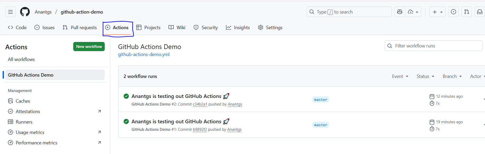

# HOW TO INITIALISE

1. create Repository
2. Once you adde this file in the repo it will initialize : `github-action-demo/.github/workflows/01-How0to-initialise.md`
3. Go to the repository and click on the `Actions` tab
4. Click on `I understand my workflows, go ahead and enable them`
5. Click on `Run workflow`
6. Now the workflow is running

